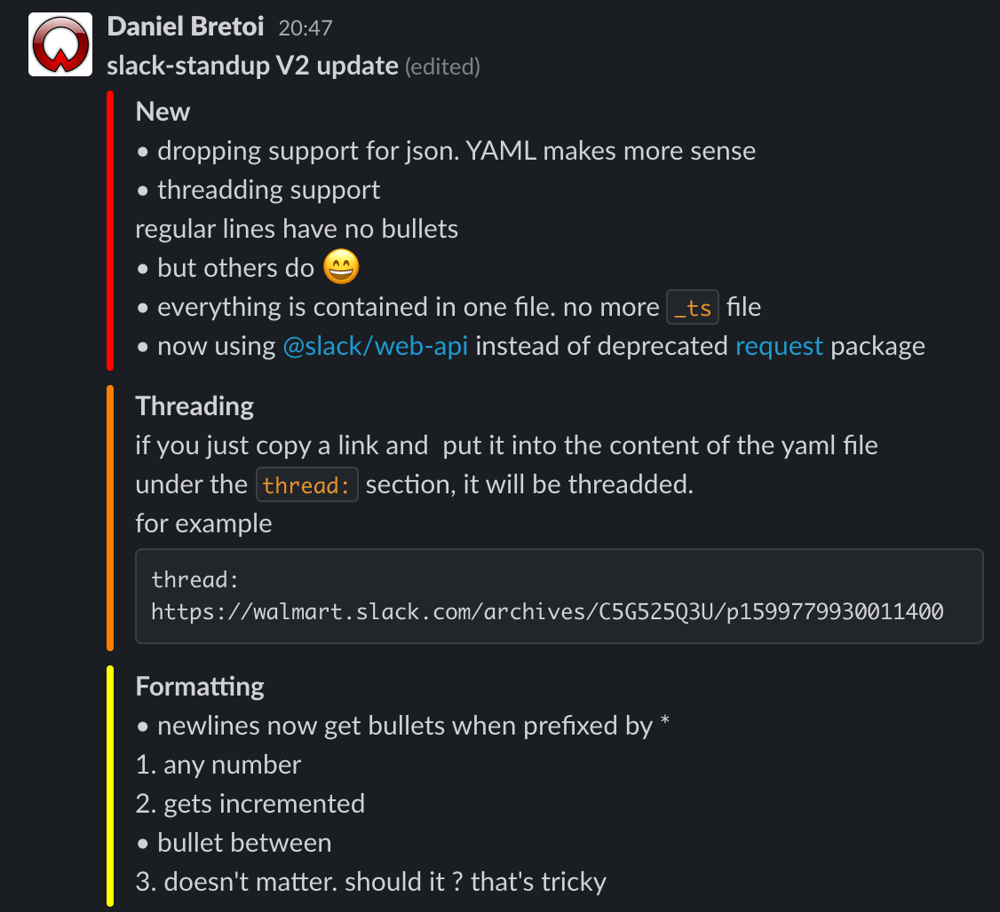

Slack Standup
==============

Slack standup is a script to make a daily status report easy using slack. When
the whole team uses this, it gives a nice overview of what everyone is working
on without taking time to actually do it in person which many find disruptive.

## Table of Contents


<!-- vim-markdown-toc GFM -->

* [Example](#example)
* [Release log](#release-log)
    * [Version 3.0.0](#version-300)
    * [Version 2.0.0](#version-200)
* [Installation](#installation)
* [Tips and tricks](#tips-and-tricks)
* [Original Author](#original-author)

<!-- vim-markdown-toc -->

## Example

See `etc/example.yaml` for what the standup looks like



## Release log
### Version 3.0.0
- dropped supprot for JSON
- swiched over to using slacks web-api
- removed emdash at start of lines to be something special
- use `1.` markdown syntax now for numbered lists
- now allows for threadded slack updates

### Version 2.0.0

__NOTE__: slack-standup follows [XDG directory
specification](http://standards.freedesktop.org/basedir-spec/basedir-spec-latest.html)


## Installation

1. `npm install slack-standup -g`


1. create an app with token at https://api.slack.com/apps/

    To get a working token you need to create a Slack app in your workspace with a user token. Here is one way on how to do that:

    1. Create a new Slack app in your workspace (you can give it any name).
    2. Under Oauth & Permissions / User Token Scopes add the `users:write` scope.
    3. Install the app into your workspace
    4. After successful installation the token for your app will then shown under Basic Information / App Credentials.


1. create
`$HOME/.config/slack-standup/slackrc.yaml`

    * properties:
        - `slack_token` - slack token from above
        - `channel` - channel you wish the post to go to
        - `user` - slack user to post as (default: env USER)
        - `editor` - editor to use to post (default: env EDITOR)

    example `slackrc.yaml`:
    ``` yaml
    slack_token: xoxp-9152601...
    channel: "#blah"
    user: daniel
    editor: nvim # or code -w ... etc
    ```

1. Sublime and VS Code Editor
    * Note you must use the -w (--wait) option with the editor.

2. TMUX Sessions
   * If you use tmux and sublime (or atom) you need to reattach the editor, you may have to install reattach-to-user-namespace. On newer versions of tmux, this shouldn't be necessary.

## Tips and tricks

1. Automatic Conversions:
    * Stars (*) at the start of lines are converted to bullets
    * Hash (1.) at the start of the lines are converted to automatically numbered lists

1. Comments in standup YAML file:
    * \# commented lines are ignored and not ported to the next day

1. Today to Yesterday:
    * When used daily, Today's lists are automatically appended to Yesterday's list. It will check posts for 7 days

1. Update Standup:
    * Re-run, edit and save; it will update the post with the new data

1. Delete Standup:
    * You can do it via the application or
    * Re-run, change 'live' to false and quit; it will remove the post

1. Threaded:
    - create a `thread:` top-level field to respond to  any thread in any channel. Get it by using slack's copy link in the UI.
        ```yaml
        thread: https://slack.com/archives/G0188U2CB/p1601478081930300
        ```

## Original Author
* https://github.com/caseman72
